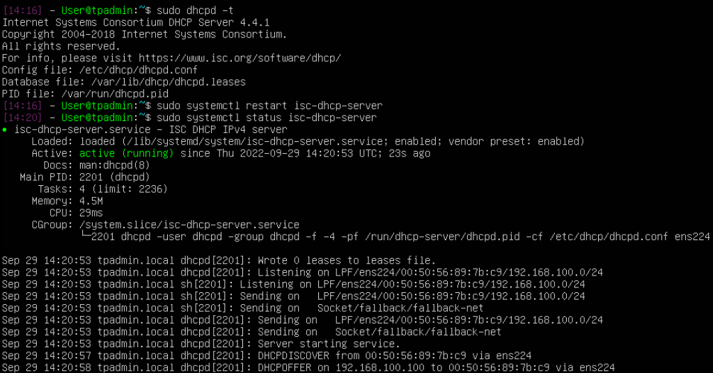

# **Exercice 1. Adressage IP (rappels)**

Avec du VSLM:
On commence par le sous-réseau ayant le plus grand nombre de machines, soit le sous-réseau 3.
Pour 52 machines(+@réseau+@broadcast), on doit a besoin de 6 bits (car 2^6=64).
Ce qui donne 32-6=26 => /26.
Donc 172.16.0.0/26 comme adresse de sous-réseau pour le sous-réseau 7, avec une plage restante 172.16.0.64/26.
Ainsi de suite.
A l'exception du sous-réseau 7, pour lequel on a besoin de seulement 5 bits (car 2^5=32).

| sous-réseau  | @sous-réseau          | @broadcast | 1ère adresse | Dernière adresse |
| :--------------- |:---------------| :--------------- |:---------------|:--------------- |
| sous-réseau 3  | 172.16.0.0/26    |  172.16.0.63/26 |  172.16.0.1/26 | 172.16.0.62/26 |
| sous-réseau 1  | 172.16.0.64/26   |  172.16.0.127/26 |  172.16.0.65/26 | 172.16.0.126/26 |
| sous-réseau 6  | 172.16.0.128/26  |   172.16.0.191/26 |  172.16.0.129/26 | 172.16.0.190/26 |
| sous-réseau 4  | 172.16.0.192/26  |    172.16.0.255/26 |  172.16.0.193/26 | 172.16.0.254/26 |
| sous-réseau 5  | 172.16.1.0/26    |  172.16.1.63/26 |  172.16.1.1/26 | 172.16.1.62/26 |
| sous-réseau 2  | 172.16.1.64/26   |   172.16.1.127/26 |  172.16.1.65/26 | 172.16.1.126/26 |
| sous-réseau 7  | 172.16.1.128/27  |    172.16.1.159/27 |  172.16.1.129/27 | 172.16.1.158/27 |

# **Exercice 2. Préparation de l’environnement**

1 - Sur vsphere, on modifie les paramètres de la VM, on lui ajoute un nouvel adaptateur réseau: ICS_E14_2014. Sur la deuxième VM, on lui ajoute ce même adaptateur réseau. De ce fait, le serveur a accès à Internet et le client à accès à Internet via le serveur.

2 - Avec la commande **ip adrr** on peut vérifier que les interfaces réseaux sont bien présentes. L'interface lo permet de contacter la machine locale sans passer par une interface qui serait accessible de l'extérieur. En d'autres termes, elle permet à la machine de se connecter à elle même sans passer par le réseau. Elle représente la machine elle-même. On peut parler d'adresse de bouclage.

3 - Pour désinstaller le paquet cloud-init, on va utiliser la commande **sudo apt-get purge cloud-init**.

4 - **sudo hostnamectl set-hostname tpadmin.local** va permettre de renommer le serveur. Ensuite, **sudo nano /etc/hosts** pour remplacer l'occurence de l'ancien nom par le nouveau. Enfin, on reboot avec **sudo reboot** pour prendre en compte le changement.

# **Exercice 3. Installation du serveur DHCP**

1 - **isc-dhcp-server** puis **systemctl status isc-dhcp-server**. Cela va afficher Active: Failed ce qui veut dire que le serveur n'a pas réussi à démarrer, ce qui est normal.

2 - Afin d'attribuer de manière permanente l'adresse IP 192.168.100.1 à l'interface réseau du réseau interne, il faut taper la commande **sudo nano /etc/netplan/50-cloud-init.yaml** et modifier le fichier de la sorte:

Ensuite, on peut exécuter la commande **sudo netplan apply** pour prendre en compte ces changements.

3 - D'abord on fait une copie du fichier pour en avoir une sauvegarde **sudo cp /etc/dhcp/dhcpd.conf /etc/dhcp/dhcpd.conf.bak**.
Les modifications apportées sont les suivantes:

default-lease-time 120;
max-lease-time 600;
authoritative;
option broadcast-address 192.168.100.255; 
option domain-name "tpadmin.local"; 

subnet 192.168.100.0 netmask 255.255.255.0 { 
  range 192.168.100.100 192.168.100.240;
  option routers 192.168.100.1;
  option domain-name-servers 192.168.100.1; 
}

default-lease-time est utilisée si le client ne demande pas de bail spécifique. Cela va "louer" une adresse IP pour 600 secondes si le client ne demande pas de délai spécifique.
max-lease-time définit le bail le plus long que le serveur peut allouer.

4 - Afin de spécifier l'interface sur laquelle le serveur doit écouter, on modifie le fichier isc-dhcp-server avec **sudo nano /etc/default/isc-dhcp-server**: INTERFACESv4="ens224";
INTERFACESv6="ens224";

5 - Validation du fichier de configuration avec la commande **sudo dhcpd -t**. Par la suite on redémarre le serveur DHCP avec **sudo systemctl restart isc-dhcp-server** et on vérifie qu'il est actif avec **sudo systemctl status isc-dhcp-server**.

6 - Premièrement, il faut suivre les mêmes étapes que pour la partie serveur: **sudo hostname set-hostname client.tpadmin.local** (avec un changement à la main dans le fichier /etc/hosts). On supprime également le paquet cloud-init.
Deuxièmement, via **hostname** on obtient bien client.tpadmin.local ; via **ip addr**, la carte réseau du client est bien notée DOWN.

7 - 
